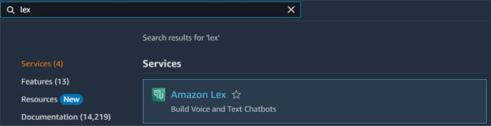
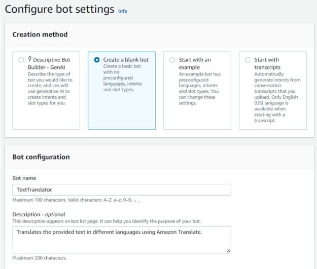
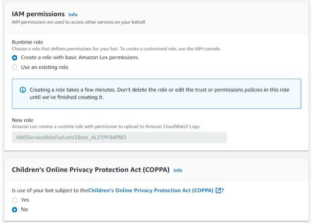
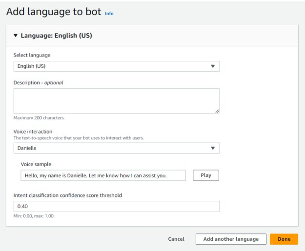
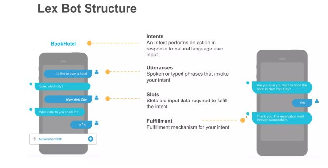
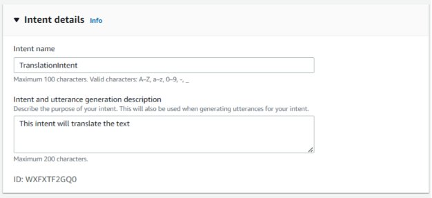
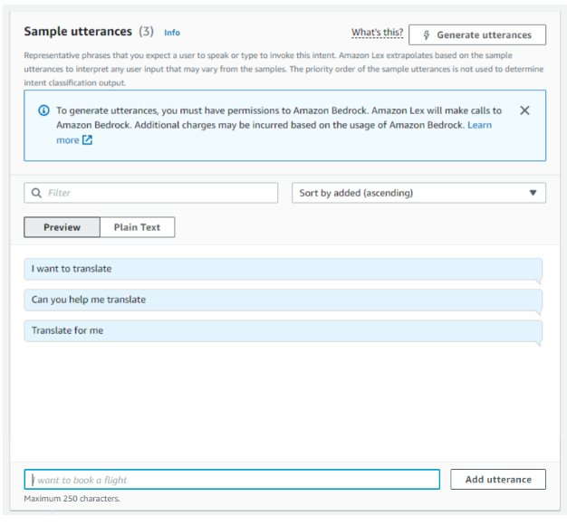
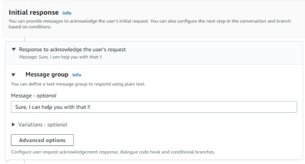
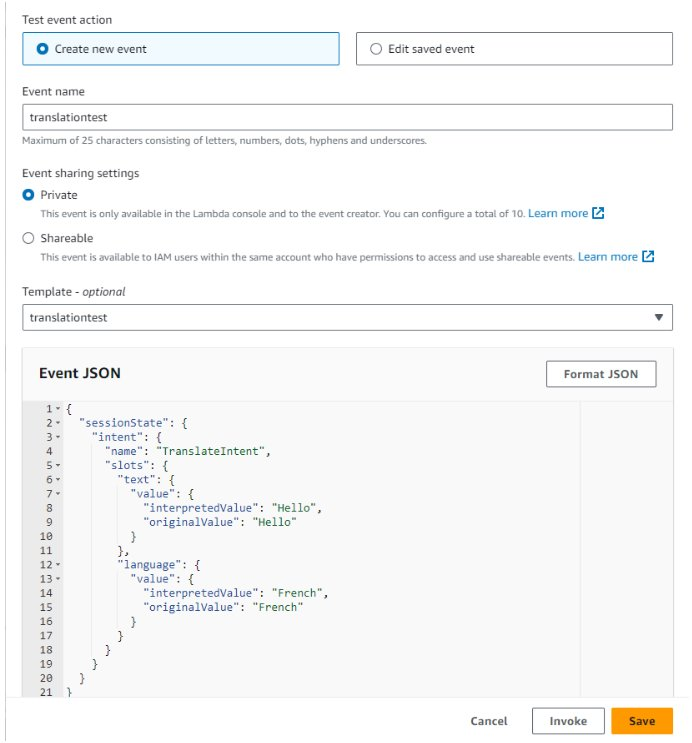
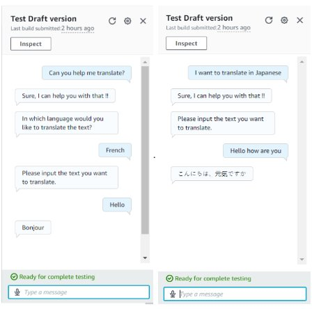

# 🌍 Language Translation Bot using Amazon Lex

A serverless chatbot that translates text into multiple languages using **Amazon Lex**, **AWS Lambda**, and **Amazon Translate** — built as part of the **Tech with Lucy** cloud course.

---

## 📌 Overview

Users interact with the **TextTranslator** Lex bot in natural language. The bot collects the text and target language, then triggers a Lambda function that calls **Amazon Translate** to return the translated result — all in real time.

---

## 🏗️ Architecture

```
User (Chat)
    │
    ▼
Amazon Lex (TextTranslator Bot)
    │   TranslationIntent
    │   Slots: text, language
    │
    ▼
AWS Lambda (lambda_function.py)
    │
    ▼
Amazon Translate
    │   Auto-detects source language
    │   Translates to target language
    │
    ▼
Response back to Lex → User
```

---

## ☁️ AWS Services Used

| Service | Purpose |
|---|---|
| **Amazon Lex** | Conversational chatbot interface |
| **AWS Lambda** | Serverless function to handle translation logic |
| **Amazon Translate** | Performs the actual language translation |
| **IAM** | Permissions for Lex and Lambda to interact |
| **Amazon CloudWatch** | Logs Lambda executions |

---

## 🗣️ Supported Languages

| Language | Code |
|---|---|
| French | `fr` |
| Japanese | `ja` |
| Chinese | `zh` |
| Spanish | `es` |
| German | `de` |
| Norwegian | `no` |

> The source language is **auto-detected** by Amazon Translate.

---

## 🤖 Bot Configuration

| Setting | Value |
|---|---|
| **Bot Name** | `TextTranslator` |
| **Intent Name** | `TranslationIntent` |
| **Language** | English (US) |
| **Voice** | Danielle |
| **Confidence Threshold** | 0.40 |

### Sample Utterances

- `I want to translate`
- `Can you help me translate`
- `Translate for me`

### Slots

| Slot | Type | Prompt |
|---|---|---|
| `text` | `AMAZON.FreeFormInput` | *Please input the text you want to translate.* |
| `language` | Custom / `AMAZON.Language` | *In which language would you like to translate the text?* |

### Initial Response

> *Sure, I can help you with that !!*

---

## 🧾 Lambda Function Details

- **Runtime:** Python 3.x
- **Handler:** `lambda_function.lambda_handler`
- **Trigger:** Amazon Lex (fulfillment hook)

### Test Event JSON

```json
{
  "sessionState": {
    "intent": {
      "name": "TranslateIntent",
      "slots": {
        "text": {
          "value": {
            "interpretedValue": "Hello",
            "originalValue": "Hello"
          }
        },
        "language": {
          "value": {
            "interpretedValue": "French",
            "originalValue": "French"
          }
        }
      }
    }
  }
}
```

### Expected Response

```json
{
  "messages": [
    {
      "contentType": "PlainText",
      "content": "Bonjour"
    }
  ]
}
```

---

## 📁 Project Structure

```
language-translation-bot-lex/
├── lambda/
│   └── lambda_function.py          # Lambda function (Python)
├── screenshots/
│   ├── 01-amazon-lex-search.png
│   ├── 02-configure-bot-settings.png
│   ├── 03-iam-permissions.png
│   ├── 04-add-language.png
│   ├── 05-lex-bot-structure.png
│   ├── 06-intent-details.png
│   ├── 07-sample-utterances.png
│   ├── 08-initial-response.png
│   ├── 09-lambda-test-event.png
│   └── 10-bot-test-demo.png
├── .gitignore
├── LICENSE
└── README.md
```

---

## 🛠️ Setup Instructions

### Prerequisites
- An active **AWS Account**
- IAM permissions for Lex, Lambda, and Translate

---

### Step 1 — Create the Lambda Function

1. Go to **Lambda → Create Function**
2. Choose **Author from scratch**
3. Settings:
   - **Function name:** `TranslationFunction`
   - **Runtime:** Python 3.x
4. Paste the code from `lambda/lambda_function.py`
5. Attach an IAM role with `TranslateFullAccess` policy
6. Click **Deploy**

---

### Step 2 — Create the Amazon Lex Bot

1. Go to **Amazon Lex → Create Bot**
2. Choose **Create a blank bot**
3. Settings:
   - **Bot name:** `TextTranslator`
   - **Description:** Translates the provided text in different languages using Amazon Translate.
   - **IAM role:** Create a role with basic Amazon Lex permissions
   - **COPPA:** No
4. Add language: **English (US)**, Voice: **Danielle**, Threshold: **0.40**

---

### Step 3 — Configure the Intent

1. Create an intent named **`TranslationIntent`**
2. Add sample utterances:
   - `I want to translate`
   - `Can you help me translate`
   - `Translate for me`
3. Set initial response: `Sure, I can help you with that !!`
4. Add slots:
   - `language` — prompt: *In which language would you like to translate the text?*
   - `text` — prompt: *Please input the text you want to translate.*
5. Under **Fulfillment**, enable Lambda function invocation → select your Lambda function

---

### Step 4 — Build & Test

1. Click **Build** in the Lex console
2. Use the **Test** panel to try a conversation:
   - User: `Can you help me translate?`
   - Bot: `Sure, I can help you with that !!`
   - Bot: `In which language would you like to translate the text?`
   - User: `French`
   - Bot: `Please input the text you want to translate.`
   - User: `Hello`
   - Bot: `Bonjour`

---

## 📸 Screenshots

| Step | Screenshot |
|---|---|
| Search Amazon Lex |  |
| Configure Bot Settings |  |
| IAM Permissions |  |
| Add Language |  |
| Lex Bot Structure |  |
| Intent Details |  |
| Sample Utterances |  |
| Initial Response |  |
| Lambda Test Event |  |
| Bot Test Demo |  |

---

## 📚 Course

Built as part of the **[Tech with Lucy](https://www.techwithlucy.com/)** cloud computing course.

---

## 📄 License

This project is open source and available under the [MIT License](LICENSE).
